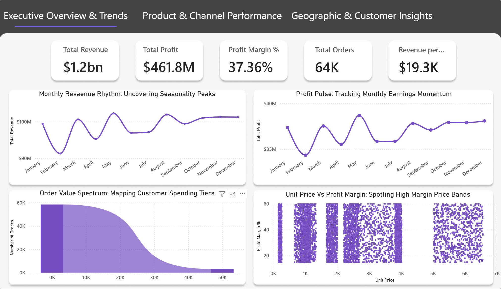
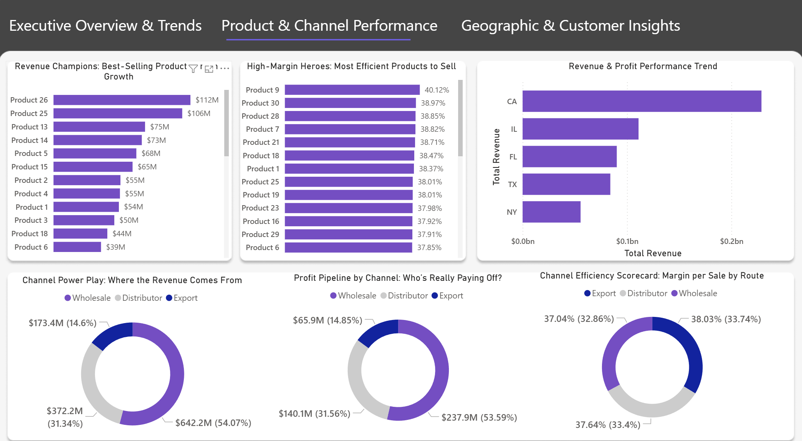
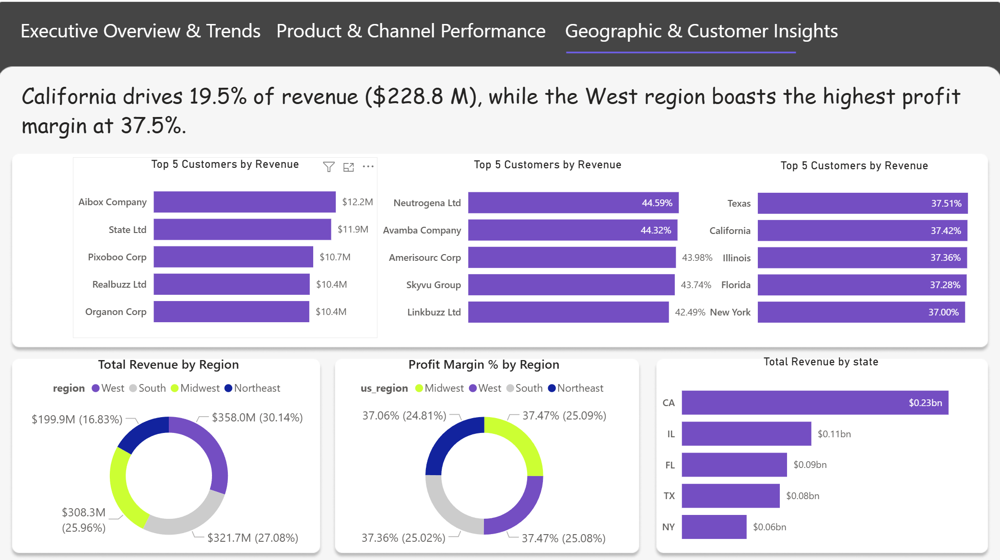

# 🚀 End-to-End Data Analytics Project: Regional Sales Performance Analysis using Python & Power BI

---

## 📊 Project Overview

This project performs a comprehensive data analytics study on 5 years of U.S. regional sales data to uncover revenue trends, profitability drivers, product performance, customer segmentation, and geographic insights.

The project combines:

* 🐍 Python (NumPy, Pandas, Matplotlib, Seaborn) for EDA
* 📊 Power BI for interactive dashboarding
* 📈 Business-driven insights & strategic recommendations

It demonstrates a complete data analytics lifecycle from raw data to decision-ready insights.

---

# 🎯 Business Problem

Organizations lacked clear visibility into:

* Seasonal revenue fluctuations
* Regional performance differences
* Product-level profitability
* Channel efficiency
* Customer revenue concentration

### Objective:

Use historical sales data to uncover growth opportunities, optimize margin strategy, and support strategic decision-making.

---

# 🛠 Tools & Technologies Used

### 🐍 Python

* NumPy
* Pandas
* Matplotlib
* Seaborn

### 📊 Business Intelligence

* Power BI
* DAX

### 📁 Data Handling

* CSV dataset consolidation
* Multi-table merging
* Feature engineering

---

# 📂 Project Files (Click to Open)

* 📊 **[Dataset](./Sales_data%28EDA%20Exported%29%20%281%29.csv)**
* 📈 **[Power BI Dashboard File](./sales%20data%20anaylsis.pbix)** *(adjust if filename differs slightly)*
* 🖼 **[Dashboard – Executive Overview](./dashboard_1.png)**
* 🖼 **[Dashboard – Product & Channel Performance](./dashboard_2.png)**
* 🖼 **[Dashboard – Geographic & Customer Insights](./dashboard_3.png)**

---

# 🔄 Project Workflow

---

## 1️⃣ Business Understanding

* Identified performance inconsistencies across U.S. regions
* Investigated seasonal sales volatility
* Evaluated SKU concentration risk
* Assessed channel profitability trade-offs

---

## 2️⃣ Data Loading & Initial Exploration

Data was loaded into Python for profiling:

```python
import numpy as np
import pandas as pd
import matplotlib.pyplot as plt
import seaborn as sns
```

Initial checks included:

* Shape & schema validation
* Data type inspection
* Summary statistics
* Distribution analysis

---

## 3️⃣ Data Cleaning & Pre-processing

* Merged multiple tables (Sales, Customers, Products, Regions)
* Standardized column names
* Dropped redundant columns
* Formatted date columns
* Created calendar fields
* Verified no duplicates or missing values

---

## 4️⃣ Feature Engineering

Created important business metrics:

* `profit = revenue - cost`
* `profit_margin_pct = profit / revenue`
* Month-based trend variables
* Region-based grouping features

---

## 5️⃣ Exploratory Data Analysis (EDA)

Using Matplotlib & Seaborn, the following analyses were performed:

### 📈 Monthly Revenue Trend

* Seasonal peaks in May–June
* January identified as lowest revenue month
* 2017 dip detected

---

### 🏆 Top Products by Revenue

* Products 26 & 25 dominate total revenue
* Revenue concentration observed
* Mid-tier SKUs show growth opportunity

---

### 💰 Profit Margin Analysis

* Top products maintain consistent 35–40% margins
* Strong pricing discipline observed

---

### 🚚 Channel Performance

* Wholesale contributes 54% of revenue
* Distributor contributes 31%
* Export contributes 14%
* Export shows highest margin efficiency

---

### 🗺 Geographic Insights

* California highest revenue state
* West region dominates overall revenue
* Northeast lowest performing region

---

### 👥 Customer Segmentation

* Revenue highly concentrated among top customers
* Large accounts with low margins identified
* High-margin mid-tier clients flagged for upsell

---

### 🔥 Correlation Analysis

Heatmap analysis revealed:

* Unit price strongly correlates with revenue & profit
* Quantity has minimal impact
* Pricing strategy drives profitability more than volume

---

# 📊 Power BI Dashboard

An interactive 3-page dashboard was built to allow stakeholders to self-serve insights.

---

## 📄 Page 1 – Executive Overview & Trends

* Total Revenue: $1.2bn
* Total Profit: $461.8M
* Profit Margin: 37.36%
* Monthly trend analysis
* Order value distribution
* Profit vs Unit price relationship

🖼 Preview:



---

## 📄 Page 2 – Product & Channel Performance

* Best-selling products
* High-margin products
* Channel revenue breakdown
* Margin by channel

🖼 Preview:



---

## 📄 Page 3 – Geographic & Customer Insights

* Revenue by region
* State-level performance
* Top customers
* Revenue vs Orders comparison

🖼 Preview:



---

# 📈 Key Business Insights

* Strong seasonality pattern (Jan low, May–June peak)
* Revenue heavily concentrated in top SKUs
* Wholesale drives volume; Export drives margin
* California contributes ~19.5% of total revenue
* Unit price is the strongest profitability driver
* Revenue concentration among top clients

---

# 💡 Strategic Recommendations

* Launch targeted seasonal promotions in low months
* Expand high-margin Export channel
* Optimize underperforming SKUs
* Replicate California strategy in other regions
* Re-evaluate discount-heavy large accounts
* Focus pricing strategy over volume growth

---

# 🎓 Skills Demonstrated

* Data Cleaning & Transformation (Pandas)
* Feature Engineering
* Statistical Analysis
* Correlation Analysis
* Business KPI Development
* Data Visualization
* Dashboard Design
* Business Storytelling

---

# 🚀 Conclusion

This project demonstrates a complete data analytics lifecycle:

> Raw Data → Cleaning → Feature Engineering → EDA → Business Insights → Strategic Recommendations → Interactive Dashboard

It reflects practical industry-ready skills in Data Analytics and Business Intelligence.


